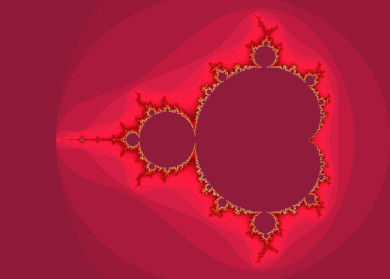
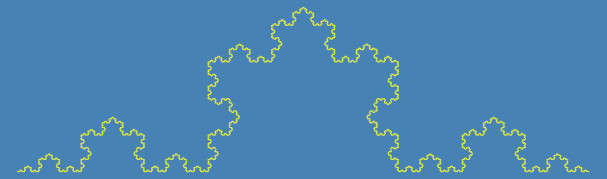
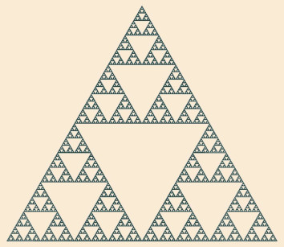
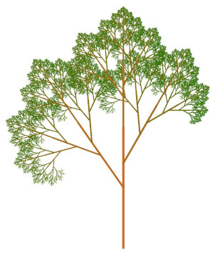

# A simple drawing library in C++

This is a simple application for the demonstration of basic features of the C++
language, like:

- variables, pointers, references
- function name overloading
- operators, operator overloading
- constant expressions
- templates
- basic STL datatypes: string, complex
- stream I/O, file I/O
- I/O manipulators
- namespaces
- classes, constructors, destructors
- instance and static variables
- normal and static methods
- factory methods
- container classes, iterators
- STL containers (vector, map)
- STL algorithms
- exceptions
- enumeration classes
- inheritance
- method overriding
- abstract base classes
- polymorphism
- lambda expressions
- concepts
- JSON serialization/deserialization

The executable can read JSON data files and create various images based on the
parameters in these files. Sample parameter files can be found in the **params**
folder. Images are generated in the **images** folder.

A makefile is provided to build the **draw** executable. Just go to the project
directory and run `make`.

To generate the sample images, execute the following:

```
for json in params/*.json; do ./draw $json; done
```

## Source and header files

The list below describes each component of the project. It is suggested to study
them in this order.

### utils.h

Contains an input stream manipulator that skips whitespace and PPM-style
comments, and another function which reads and parses a JSON file, or reads from
standard input.

### rgb.h

Defines the RGB class which is the abstraction of a color. Stores red, green
and blue components as integer numbers. Supports construction from numeric
values, hexadecimal strings, and predefined named colors.

### position.h

Defines the Position class which is the abstraction of a 2D vector. Contains
basic vector arithmetic operations for addition, subtraction, and scaling.

### boundingbox.h

Defines the BoundingBox class which tracks the minimum and maximum extents of a
set of 2D positions. Supports incremental expansion via operator+=, scaling via
operator*=, and conversion to a pixel-based ScreenSize.

Depends on:

- position.h

### matrix.h

Defines a generic 2D matrix stored in row-major order as a template class.
Provides element access by (row, col) index with both checked (at()) and
unchecked (operator()) variants, as well as forward iterators over all elements
in row-major order.

### canvas.h

Defines a 2D pixel canvas based on a Matrix of RGB colors. Pixel access is
possible with either (x,y) coordinates or Position objects. Implements PPM file
I/O. Pixel (0,0) is the top-left of the canvas; x grows right, y grows down,
matching the mathematical convention used elsewhere in this project.
Out-of-bounds writes through operator() and operator[] are silently discarded
(written to an offscreen pixel sink). Use at() when you want a bounds-checking
throw instead.

Depends on:

- rgb.h
- position.h
- matrix.h
- utils.h (to be able to skip comments while reading PPM files)

### complexgrid.h

Defines a regular 2D grid of complex numbers covering a rectangular region. The
grid spans a rectangular region in the complex plane defined by two corner
values. Given a target resolution (total node count), the grid dimensions are
chosen to preserve the aspect ratio of the region. Nodes are stored in row-major
order from top-left to bottom-right (i.e. the imaginary component decreases as
the row index increases. Typical use: pre-computing the complex sample points
for the Mandelbrot set renderer.

### mandelbrot.cc

Mandelbrot set image generator. Renders the Mandelbrot set by iterating
z = z² + c for each point c on a ComplexGrid and mapping the escape iteration
count to a color palette.

Depends on:

- rgb.h
- position.h
- matrix.h
- canvas.h
- complexgrid.h
- utils.h (to be able read JSON file contents)



### transformation.h

Represents a 2D affine transformation as a 3×3 homogeneous matrix. Inherits from
Matrix<double> and stores the transformation in row-major homogeneous
coordinates. Provides static factory methods for the most common transformations
(identity, translation, scaling, rotation, mirroring) as well as a convenience
method for mapping world coordinates to screen coordinates. Transformations can
be composed with operator*, and applied to a Position via
operator*(Transformation, Position).
 
Depends on:

- position.h
- boundingbox.h
- matrix.h

### drawable.h

Defines an abstract base class for all drawable objects. Defines the interface
that every drawable shape must implement:

- rendering onto a Canvas,
- applying a Transformation,
- computing its BoundingBox,
- producing a heap-allocated copy.

DrawableList and the operator<< helper allow drawable objects to be composed and
rendered without exposing ownership details.

Depends on:

- rgb.h
- position.h
- boundingbox.h
- matrix.h
- canvas.h
- transformation.h
- utils.h

### point.h

Defines a single-pixel point drawable. Sets exactly one pixel on the canvas at
the given position. Unlike Dot, no diameter is involved — the point always
occupies exactly one pixel regardless of scale.

Depends on:

- rgb.h
- position.h
- boundingbox.h
- matrix.h
- canvas.h
- transformation.h
- drawable.h
- utils.h

### line.h

A thick line segment drawable. Draws a line segment with a given width using a
per-pixel distance test: each pixel within half the line width from the segment
is colored. This produces rounded endpoints and smooth edges regardless of
orientation.

Depends on:

- rgb.h
- position.h
- boundingbox.h
- matrix.h
- canvas.h
- transformation.h
- drawable.h
- utils.h

### dot.h

A filled circular dot drawable. Renders as a zero-length Line segment with the
given diameter, which produces a disk of the specified size centered at pos.

Depends on:

- rgb.h
- position.h
- boundingbox.h
- matrix.h
- canvas.h
- transformation.h
- drawable.h
- line.h
- utils.h

### polygon.h

An open or closed polygon drawable. Inherits from both Drawable and
std::vector<Position>, so it stores its vertices directly and supports standard
vector operations. Drawing connects consecutive vertices with thick Line
segments. If the first and last vertices are the same the polygon is visually
closed.

Depends on:

- rgb.h
- position.h
- boundingbox.h
- matrix.h
- canvas.h
- transformation.h
- drawable.h
- line.h
- dot.h
- utils.h

### drawablelist.h

An ordered, owning collection of Drawable objects. DrawableList is essentially a
vector of Drawable objects. Because Drawable is an abstract class,
std::vector<Drawable> is impossible. Instead, the list stores heap-allocated
polymorphic pointers (std::vector<Drawable*>) and hides pointer management
behind custom iterator classes. The list owns its elements: it deep-copies on
construction and copy-assignment (via Drawable::copy()), and deletes each
element on destruction or clear(). Move construction and move assignment
transfer ownership without copying. DrawableList itself satisfies the Drawable
interface, so lists can be nested inside other lists.

Depends on:

- rgb.h
- position.h
- boundingbox.h
- matrix.h
- canvas.h
- transformation.h
- drawable.h
- utils.h

### koch.cc

Koch snowflake fractal generator. Implements the Koch class and the genKoch()
entry point. The Koch snowflake is generated recursively by replacing each line
segment with four sub-segments: the middle third is replaced by two sides of an
equilateral triangle.

Depends on:

- rgb.h
- position.h
- boundingbox.h
- matrix.h
- canvas.h
- transformation.h
- drawable.h
- line.h
- dot.h
- drawablelist.h
- utils.h



### sierp.cc

Sierpinski triangle fractal generator. Implements the Sierpinski class and the
genSierpinski() entry point. The Sierpinski triangle is generated recursively:
each triangle is subdivided into three half-size copies placed at its three
corners, leaving the central triangle empty.

Depends on:

- rgb.h
- position.h
- boundingbox.h
- matrix.h
- canvas.h
- transformation.h
- drawable.h
- line.h
- dot.h
- polygon.h
- drawablelist.h
- utils.h



### tree.cc

Fractal tree generator. Implements the Tree class and the genTree() entry point.
A fractal tree is built by recursively spawning branches from each trunk segment
according to a configurable list of Branch descriptors. Each branch descriptor
specifies how its child trunk segment is scaled, rotated, translated, and
color-faded relative to its parent.

Depends on:

- rgb.h
- position.h
- boundingbox.h
- matrix.h
- canvas.h
- transformation.h
- drawable.h
- line.h
- dot.h
- drawablelist.h
- utils.h



### draw.h

Declares generator functions used in koch.cc, tree.cc and sierp.cc so that
draw.cc knows them.

### draw.cc

This is the main entry point for the drawing suite. Reads a JSON parameter file
whose top-level "type" field selects which fractal generator to invoke (koch,
mandelbrot, sierpinski, or tree), then dispatches to the appropriate generator
function.

Depends on:

- draw.h
- utils.h

### json.hpp

See the documentation at https://json.nlohmann.me
